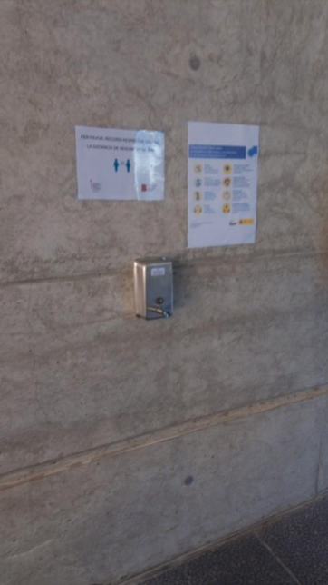

# Higiene i seguretat

Es fan les següents recomanacions per mantenir la higiene i seguretat a l'edifici Europa:

- Rentar-se les mans a l'entrar al centre i de forma freqüent al llarg de la jornada. Els accessos a l'edifici Europa disposen d'hidrogels.

- Mantenir en tot moment la distància de seguretat de 2 metres.
- Ús obligatori de mascareta en aquells espais on no es pugui garantir la distància de seguretat de 2m.
- Es prega a tots els usuaris del centre que davant qualsevol possible símptoma de COVID-19, no accedeixin a l'edifici i evitin situacions de contacte social.

# Accessos

Pel que fa als accessos de l'edifici Europa, aquestes són les recomanacions:

- L'ús de l'ascensor queda limitat a una persona. En qualsevol cas, es recomana dintre del possible utilitzar sempre les escales.
- Es recorda respectar sempre la distància de seguretat als accessos de l'edifici, ja que és una zona especialment concorreguda.

# Ús de zones comuns

L'ús de les zones comunes de l'edifici Europa seguirà les següents indicacions:

- Obligatori l'ús de mascaretes a les zones comunes.
- Es recomana reduir al mínim possible les reunions presencials. En cas de realitzar-ne s'haurà de mantenir la distància de seguretat en tot moment i fer ús de mascaretes.
- Màxim 1 persona a cada bany. S'assignen els següents banys:
  - Planta soterrani: usuaris de la planta soterrani i visites.
  - Recomanem que les empreses d'una planta no emprin els serveis d'altres plantes.

# Visites

Es prega restringir les visites al mínim estrictament necessari i acompanyar i informar els visitants per assegurar que compleixen amb les normes de seguretat indicades.
