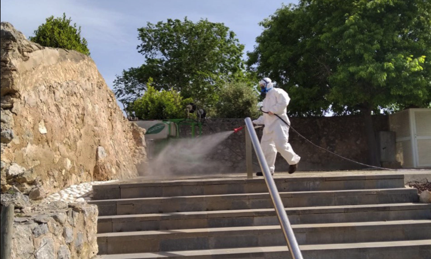
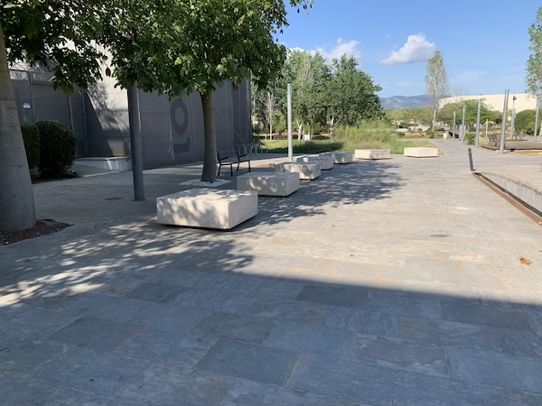

This public interest action protocol of ParcBit elaborated by the Fundació Bit establishes the essential guidelines of hygiene and safety, the use of access points and common areas.

The aim is, together, to make ParcBit a safe space. Individual responsibility is crucial to ensure the safety of the Park community. A communication channel has been set up in Telegram where all the measures and news regarding COVID-19 will be reported.

The following actions have been carried out to maintain hygiene and safety at ParcBit:

- General disinfection, twice a month, of those elements of the usual manual contact in the park: railings, benches, containers, etc., with a bleach based solution.

- Temperature control to users, at the entrance barrier to ParcBit.
- Closure of the community dining room.
- Extension of the terraces of the bars in order to guarantee the safety distances.
- Outdoor common areas:
  - Street furniture on the main streets with the same purpose.
  - New picnic tables in the shade around the watercourse area.
  - Street furniture in the squares placed with a distance of 2.5m between people, to use as spaces for snacks / lunch for the Park workers.

- Signage of the preferences for crossing bridges.
