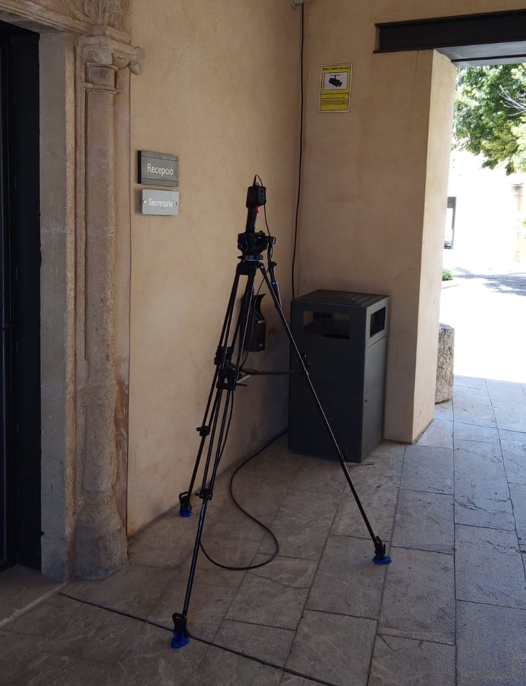

# Hygiene and safety

Find following recommendations to maintain hygiene and safety at the Son Espanyol Business Center:

- Wash your hands when entering the center and frequently throughout the day. The access points to the Son Espanyol Business Center include hydrogels.
- Maintain a safety distance of 2 meters at all times.
- Mandatory use of a face mask in those spaces where the safety distance of 2m cannot be guaranteed.
- Redistribution of work furniture has been carried out to ensure the safety distance.
- All users of the center are requested not to enter the Center and avoid situations of social contact in the event of any possible symptoms of COVID-19. In case of confirming any positive result, inform quickly to management to be able to take the measures of disinfection of the premises.
  For this cause, a specific e-mail is available for these positive COVID-19 cases: coronavirus@fundaciobit.org.

# Access points

- The use of the elevator is limited to one person. In any case, it is recommended, whether possible, to use the stairs.
- Remember to continually respect the safety distance to the access points to the building, since they are a particularly crowded area.
- Thermal cameras will be used to voluntarily check Fundació Bit employees temperature and to check external personeel temperature.

# Use of common areas

Following instructions are required to use the common areas of the Son Espanyol Business Center building:

- It is mandatory to use face masks in common areas.
- All rooms and common areas have been reduced their capacity by a third. All spaces have an indication of the capacity allowed.
- Each room will have a disinfectant product and roll of paper. It is requested to the users, please, to disinfect the used area when leaving.
- It is recommended to reduce face-to-face meetings to the minimum. If this is the case, the safety distance must be maintained at all times and face masks must be used.
- Auditorium opening date: June 1
- The following bathrooms are assigned to the companies:
  - Basement floor (next to the auditorium): Fundació Bit.
  - Basement floor (next to the elevator): cleaning staff.
  - Ground floor (reception bathrooms): Fundació Bit.
  - Ground floor (restaurant bathrooms). Olympia Travel.
  - First floor: Preverisk.
  - Second Floor: BIOIB, CliQIB, Balears.t.

# External visits

Please restrict visits to the minimum strictly necessary, and accompany and inform visitors to ensure that they comply with the indicated safety rules.

## Record of external visits

In order to have an optimal control of the movement of people inside the building, and to warn efficiently about a possible positive case of COVID-19 to all the people who may have been exposed, the surveillance department and the receptionist will perform a record of the visits. This list will be kept confidential and the information will be deleted on a monthly basis.
